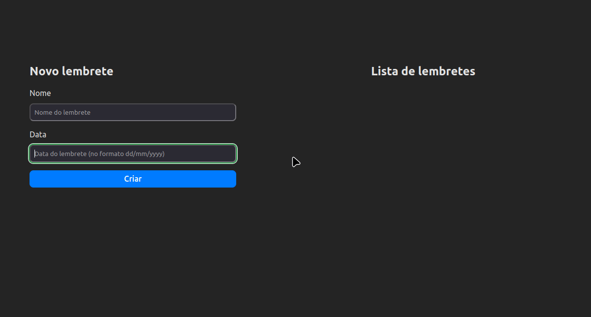
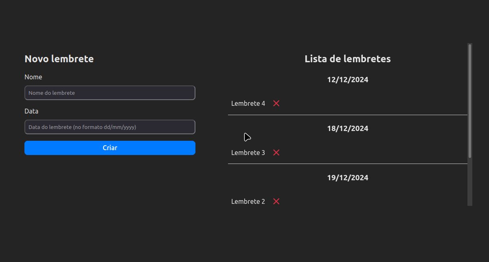

# TesteDTI

Repositório referente ao processo seletivo para estágio na DTI. Instruções fornecidas no [pdf](docs/1.0%20-%20Teste%20dti%20-%20Dev%20Estágio.pdf). Documentação das portas da API disponíveis em [MD](docs/api.md) ou pelo Swagger (http://localhost:5107/swagger/index.html).

**Nome completo:** Pedro Negri Leão Lambert  
**Email:** Pedronll@outlook.com     
**Linkedin:** https://www.linkedin.com/in/pedro-nllambert/  
**Telefone:** 31 99828-8251  

- [Premissas Assumidas](#premissas-assumidas)
- [Instruções para Executar o Sistema](#instruções-para-executar-o-sistema)
    - [Com docker-compose](#docker-compose)
    - [Com docker](#docker)
    - [Sem containers ("manual")](#manual)
- [Tecnologias, ferramentas e linguagens utilizadas](#tecnologiasferramentaslinguagens-utilizadas)
- [Decisões de projeto: arquitetura da solução e processo de desenvolvimento](#decisões-de-projeto)
- [GIFs da aplicação funcionando](#gifs-com-a-aplicação-funcionando)
    - [Lembrete criado com sucesso](#lembrete-criado-com-sucesso)
    - [Erro ao criar lembrete](#erro-ao-criar-lembrete)
    - [Lembrete sendo deletado](#lembrete-sendo-deletado)

## Premissas Assumidas

- Não será necessário autenticação/validação, visto que isso não foi definido no PDF de instruções.

## Instruções para Executar o Sistema

### Docker-Compose
```bash
docker-compose up --build
```

### Docker
```bash
docker network create testeDTINetwork
docker build -t apidockerimage -f Dockerfile.Backend .
docker run -d --network testeDTINetwork -p 5107:8080 --name apidockercontainer apidockerimage
docker build -t react-app -f Dockerfile.Frontend .
docker run -d --network testeDTINetwork -p 5173:80 --name reactappdockercontainer react-app
```
Aplicação acessível por http://localhost:5173
Documentação da API acessível por http://localhost:5107/swagger/index.html

### Manual
```bash
dotnet run --project ./Solution/API/
npm --prefix ./Frontend install 
npm --prefix ./Frontend run dev
```

## Tecnologias/Ferramentas/Linguagens utilizadas
- C#/React/SQLite
- XUnit (83% Test Coverage)
- ErrorOr (C# Error Handling)
- Axios (Chamadas do React para a API)
- Swagger (Docs interativos para a API)
- Docker && Docker-compose
- Postcss
- [Postman](./docs/TesteDTI.postman_collection.json)

## Decisões de Projeto

Para a realização do projeto comecei organizando os requisitos. Pensando primeiro na criação da API, os requisitos seriam criar lembretes, buscar todos os lembretes e apagar um lembrete. Portanto, serão necessárias as seguintes portas:

| HTTP   | Nome da Porta   | Status HTTP para Sucesso | Possíveis Erros                                                                 |
|--------|------------------|--------------------------|---------------------------------------------------------------------------------|
| POST   | /lembretes       | 201 Created              | 400 Bad Request - Caso a data esteja má formatada ou o nome não esteja presente |
| GET    | /lembretes       | 200 OK                   |                                                                                 |
| DELETE | /lembretes/{id}  | 204 No Content           | 404 Not Found - Caso o lembrete não exista                                      |

Além disso, já organizei quais testes automáticos seriam necessários para garantir o funcionamento desejado da API:

| Test Name                          | Done |
|------------------------------------|------|
| Criar lembrete                     |      |
| Criar lembrete sem nome            |      |
| Criar lembrete sem data            |      |
| Criar lembrete com data má formatada |      |
| Criar lembrete sem nome nem data   |      |
| Deletar lembrete                   |      |
| Deletar lembrete inexistente       |      |
| Buscar todos lembretes             |      |

Antes de começar a programar a API, tomei as decisões arquiteturais necessárias para garantir que minha aplicação fosse bem desenvolvida. Para isso, utilizei a arquitetura limpa, preocupando-me com todos os princípios SOLID e com a coesão dos componentes, de modo a garantir que a aplicação fosse consistente em todos os seus níveis.

Essa arquitetura é centrada no domínio da aplicação, que, no contexto do desafio, se limita a uma única entidade. Além dessa entidade, a aplicação é organizada em três camadas distintas: controllers para entrada e saída, casos de uso para a lógica e a camada de persistência com o banco de dados. A comunicação com o banco de dados é definida por uma interface, e sua implementação adapta os métodos definidos para o banco de dados escolhido.

No contexto do desafio, são necessários três casos de uso: deletar um lembrete, buscar todos os lembretes e criar um novo lembrete. Para cada um desses casos de uso, é criada uma interface que será usada para abstrair a implementação na comunicação com eles. As implementações dos casos de uso utilizam a interface de comunicação com o banco de dados, a qual é injetada com uma implementação na criação deles. Além disso, o controller depende apenas das interfaces dos casos de uso. Durante sua criação, os casos de uso são injetados, e o controller passa a abstrair todos os detalhes de baixo nível.

Com isso, busquei entregar o comportamento esperado, mantendo a estrutura interna organizada de maneira que qualquer alteração futura nos requisitos da aplicação tenha um custo de implementação estável. Em outras palavras, sem a necessidade de alterações no código já implementado, obedecendo ao princípio "Open/Closed". Como não temos múltiplos atores no contexto da aplicação e as classes estão bem divididas em seus papéis, o princípio de responsabilidade única está sendo atendido.

Quanto aos outros princípios SOLID, ao fazer as classes se comunicarem com interfaces (abstrações) e não com implementações, o princípio de substituição de Liskov e o princípio de inversão de dependências estão sendo obedecidos. Ou seja, as implementações (classes filhas) podem ser usadas no lugar das interfaces (classes pai) sem alterar o comportamento, e as classes de alto nível não precisam conhecer os detalhes de baixo nível. Por último, o princípio de segregação de interfaces está sendo obedecido na construção da API, visto que, cada classe implementa uma interface com apenas os métodos necessários para si, não trazendo depêndencias extras.


Alguns detalhes importantes da implementação são:

- Além da validação dos dados no front-end, padronizei os modelos de entrada e saída em "contracts" e utilizei o design pattern abstract factory para a criação dos lembretes, aplicando as regras de negócio.
- Adicionei validações para datas mal formatadas, datas passadas e nomes inexistentes. Também incluí a validação de limite máximo no tamanho dos nomes para garantir que não armazenaremos dados excessivamente grandes no banco de dados.
- A interface da aplicação possui scroll na lista de lembretes e regras CSS para dispositivos com telas pequenas, garantindo uma experiência de usuário adequada em diferentes dispositivos.


## GIFs com a aplicação funcionando
### Lembrete criado com sucesso


### Erro ao criar lembrete


### Lembrete sendo deletado
