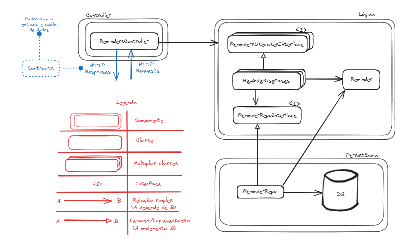

# TesteDTI

Repositório referente ao processo seletivo para estágio na DTI. Instruções fornecidas no [pdf](docs/1.0%20-%20Teste%20dti%20-%20Dev%20Estágio.pdf).

**Nome completo:** Pedro Negri Leão Lambert  
**Email:** Pedronll@outlook.com     
**Linkedin:** https://www.linkedin.com/in/pedro-nllambert/  
**Telefone:** 31 99828-8251  

## Premissas Assumidas

- Não será necessário autenticação/validação, visto que isso não foi definido no PDF de instruções.

## Instruções para Executar o Sistema

(As instruções para executar o sistema serão adicionadas assim que o desenvolvimento for concluído.)

## Decisões de Projeto

Para a realização do projeto comecei organizando os requisitos. Pensando primeiro na criação da API, os requisitos seriam criar lembretes, buscar todos os lembretes e apagar um lembrete. Portanto, serão necessárias as seguintes portas:

| HTTP   | Nome da Porta   | Status HTTP para Sucesso | Possíveis Erros                                                                 |
|--------|------------------|--------------------------|---------------------------------------------------------------------------------|
| POST   | /lembretes       | 201 Created              | 400 Bad Request - Caso a data esteja má formatada ou o nome não esteja presente |
| GET    | /lembretes       | 200 OK                   |                                                                                 |
| DELETE | /lembretes/{id}  | 204 No Content           | 404 Not Found - Caso o lembrete não exista                                      |

Além disso, já organizei quais testes automáticos seriam necessários para garantir o funcionamento desejado da API:

| Test Name                          | Done |
|------------------------------------|------|
| Criar lembrete                     |      |
| Criar lembrete sem nome            |      |
| Criar lembrete sem data            |      |
| Criar lembrete com data má formatada |      |
| Criar lembrete sem nome nem data   |      |
| Deletar lembrete                   |      |
| Deletar lembrete inexistente       |      |
| Buscar todos lembretes             |      |

Antes de começar a programar a API, tomei as decisões arquiteturais necessárias para garantir que minha aplicação fosse bem desenvolvida. Para tal, utilizei a arquitetura limpa, me preocupando com todos os princípios SOLID e os princípios de componentes para que a aplicação fosse coesa em todos os seus níveis.

Essa arquitetura é centrada no domínio da aplicação que, no contexto do desafio, se limita a apenas uma entidade. A partir dela, temos uma interface para a lógica da aplicação que será implementada por uma classe de usecases e uma interface para a comunicação com a camada de persistência. As rotas são implementadas conversando com a interface dos casos de uso.

Com isso, busquei entregar o comportamento esperado enquanto mantinha a estrutura interna organizada de maneira que qualquer alteração futura nos requisitos da aplicação tivesse seu custo de implementação estável. Ou seja, sem que fossem necessárias alterações no código já implementado, obedecendo ao "Open/Closed Principle". Como não temos múltiplos atores no contexto da aplicação e as classes estão bem divididas em seus papéis, o princípio de responsabilidade única está sendo atendido.

Quanto aos outros princípios SOLID, ao fazer as classes se comunicarem com as interfaces (abstrações) e não as implementações, o princípio de substituição de Liskov e o princípio de inversão de dependências estão sendo obedecidos. Ou seja, as implementações (classes filhas) podem ser usadas no lugar das interfaces (classes pai) sem que o comportamento seja alterado e as classes de alto nível não precisam saber dos detalhes de baixo nível.

Por último, o princípio de segregação de interfaces é o único que não será propriamente implementado, afinal a interface de caso de uso terá todos os métodos necessários em uma única interface. Essa decisão foi tomada visto que os requisitos são simples e se limitam a um CRUD, sendo assim, não vi a necessidade de criar uma interface para cada um dos casos de uso, adaptando um pouco dos princípios de arquitetura limpa para um pouco do desenvolvimento rápido de aplicações.

